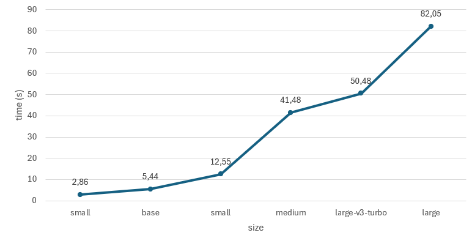

<h1 align="center">
  <br>
  <a href="https://www.linkedin.com/feed/update/urn:li:activity:7352730690272006145"></a>
  <br>
  Automatic Speech Recognition, Transcription and Translation System
  <br>
</h1>

<h4 align="center">Contact and <a>Installers</a>.</h4>

  <div style="text-align: center;">
  
  [](https://www.linkedin.com/in/mateus-j-marques)
  [](mailto:m.marques.professional@gmail.com)
  [](https://www.anaconda.com/download/success)
  [](https://openai.com/pt-BR/index/whisper)
  [](https://git-scm.com)
  
  </div>

<p align="center">
  <a href="#working-Summary">Working Summary</a> •
  <a href="#how-to-use">How To Use</a> •
  <a href="#how-it-works">How it works</a> •
  <a href="#benchmark">Benchmark</a> •
  <a href="#contact">Contact</a> •
  <a href="#related">Related</a> •
  <a href="#license">License</a>
</p>

<h1 align="center">
  <br>
  <a href="https://www.linkedin.com/feed/update/urn:li:activity:7352730690272006145"></a>
  <br>
</h1>

## Working Summary

The whisper_transcript system is a Python-based application that uses OpenAI's Whisper library for audio and video transcription. It supports the processing of videos from YouTube URLs, including YouTube Shorts, as well as local video files stored on the computer. Transcription files generated in SRT format can be saved to a user-specified location. The tool offers an optional initial prompt entry, allowing the user to describe the type of video (e.g. technical vocabulary or specific context), which can improve transcription performance and accuracy. In addition, it includes a selection of languages, enabling transcription in Portuguese, English and Spanish, with the ability to translate the description into the desired language. The choice of model size covers six options - tiny, base, small, medium, large and large-v3-turbo - where tiny offers greater speed and large provides higher quality results, albeit with longer processing times. All processing is done on CPU, ensuring compatibility in environments without GPU support.

## How To Use

You need to create a virtual environment using anaconda in a terminal

```bash
# create a virtual environment
$ conda create --name whisper_env python=3.12

# activate virtual environment
$ conda activate whisper_env
```

To clone and run this application, you'll need [Git](https://git-scm.com)  installed on your computer. From your command line:

```bash
# Clone this repository
$ git clone https://github.com/MM-coder-bit/whisper_transcript.git

# Go into the repository
$ cd whisper_transcript
```
now you'll need install all dependecies

```bash
# install dependecies
$ pip install -r requirements.txt
```
now execute the application

```bash
# execute
$ python transcript.py
```

## How it works

<h1 align="center">
  <br>
  <a href="https://www.linkedin.com/feed/update/urn:li:activity:7352730690272006145"></a>
  <br>
</h1>

Whisper's architecture incorporates an optimized end-to-end solution, taking advantage of a Transformer encoder-decoder structure for efficient audio processing and transcription. The input audio is divided into 30-second segments, converted into a log-Mel spectrogram and then processed by an encoder. A meticulously trained decoder generates the corresponding text caption, incorporating special tokens that allow the unified model to perform a number of tasks, including language identification, sentence-level timestamping, multilingual speech transcription and speech-to-English translation. This architecture offers a robust and adaptable approach to audio analysis and transcription.

Whisper models are designed for speech recognition and translation, being able to transcribe spoken audio into text in its original language (automatic speech recognition, ASR) and translate it into English (speech translation). Developed by OpenAI researchers, these models were designed to investigate the resilience of speech processing systems trained with extensive weak supervision. The set consists of nine models of different sizes and capabilities, detailed in the attached table.

<h1 align="center">
  <br>
  <a href="https://www.linkedin.com/feed/update/urn:li:activity:7352730690272006145"></a>
  <br>
</h1>

## Benchmark

A benchmark was conducted to evaluate the performance of Whisper's different model sizes using a 40-second [video](https://www.youtube.com/shorts/sEyfPS-3UvU) with the theme 'Looking for ways to elevate your portfolio'. The results indicated processing times ranging from 2.8 seconds to 82 seconds.

<h1 align="center">
  <br>
  <a href="https://www.linkedin.com/feed/update/urn:li:activity:7352730690272006145"></a>
  <br>
  <span style="font-size: 9px;">Intel Core i7, 16 GB RAM (Test System)</span>
</h1>

and evaluating the quality of the results, I came to these conclusions

<h1 align="center">
  <br>
  <a href="https://www.linkedin.com/feed/update/urn:li:activity:7352730690272006145"></a>
  <br>
</h1>

## Contact

[Linkedin](https://www.linkedin.com/in/mateus-j-marques)

## Related

[OpenAI](https://openai.com/pt-BR/index/whisper)

## License
